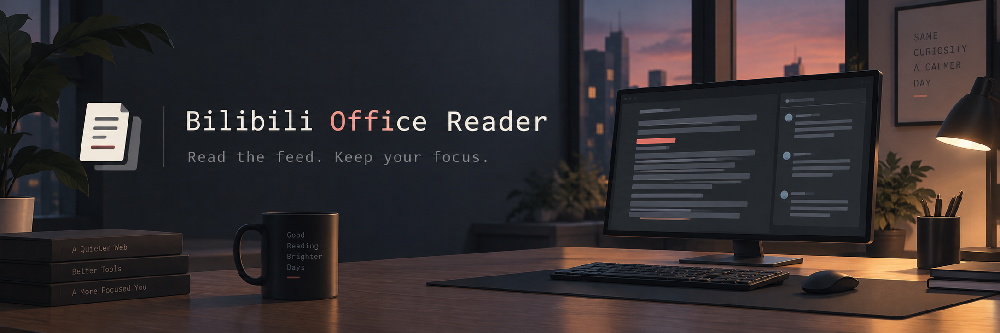

<p align="center">
  
</p>

<h1 align="center">Bilibili Office Reader</h1>

<p align="center">
  <a href="https://github.com/Hedwynnn/bilibili-office-reader/releases/tag/v1.0.0"></a>
  <a href="./LICENSE"></a>
  <a href="https://t.bilibili.com/"></a>
</p>

<p align="center"><strong>Read the feed. Keep your focus.</strong></p>

上班的时候，只是想瞄两眼关注的 UP 今天又发表了什么高见，却不想先迎接满屏封面、图片、视频和热闹到飞起的按钮——于是就有了这个脚本。

**Bilibili Office Reader** 会把 B 站动态页收拾成一份安静的纯文字信息流：财经观点、赛事锐评、长文碎碎念，都可以像读资料一样慢慢看。页面清爽一点，注意力就能多留一会儿。至于你读的到底是不是工作资料，只有你自己知道。

它不打算把 B 站变成另一个复杂客户端，只想认真做好一件小事：让摸鱼也可以低调、顺手、有条理。

> 本项目是非官方第三方用户脚本，与哔哩哔哩及其关联公司无隶属或合作关系。“哔哩哔哩”和“Bilibili”是其各自权利人的商标。

## 实际效果

<p align="center">
  
</p>

<p align="center"><em>封面和花哨组件先下班，正文留下来继续值班。</em></p>

## 功能

- 隐藏封面、图片和复杂界面，以纯文字列表展示动态。
- 自动去重，并过滤空动态、直播通知和无法查看的充电专属动态。
- 支持全部动态、排除视频和纯文字筛选。
- 支持手动给 UP 主分组并按分组筛选。
- 支持长文展开与收起。
- 在右侧抽屉阅读对应动态的纯文字评论，支持分页、重试和滚动位置恢复。
- 无操作一段时间后自动刷新；阅读长文、评论或设置时暂缓刷新。
- 指定分组出现新动态时提供页内提醒，并可选择开启系统通知。
- 支持字号、行距和正文预览设置。
- 支持配置导出、导入、合并、替换和撤销。

## 安装

### 从 Greasy Fork 安装

[点击进入 Greasy Fork 安装页](https://greasyfork.org/zh-CN/scripts/596150-bilibili-office-reader)，然后选择“安装此脚本”即可。

### 从 GitHub 安装

1. 安装 [Tampermonkey](https://www.tampermonkey.net/) 或兼容的用户脚本管理器。
2. 打开 [`bilibili-office-reader.user.js`](./bilibili-office-reader.user.js) 的 Raw 页面。
3. 在用户脚本管理器弹出的页面中确认安装。
4. 登录 B 站并访问 <https://t.bilibili.com/>。

从旧版本升级时，建议直接覆盖安装，不要先删除旧脚本，以免用户脚本管理器同时清除本地设置。

## 使用

- 页面顶部工具栏可切换内容类型、作者分组以及手动刷新。
- 动态下方的“查看评论”打开右侧评论抽屉；再次点击同一按钮可收起。
- 用户脚本管理器菜单中的“阅读与备份”用于调整显示、通知和配置备份。
- 系统通知默认关闭，需要时可在设置中主动开启。

## 权限与隐私

| 权限 | 用途 |
| --- | --- |
| `GM_getValue` / `GM_setValue` | 在本地保存分组、筛选和阅读设置 |
| `GM_registerMenuCommand` | 提供设置与备份入口 |
| `GM_notification` | 可选的系统通知 |
| `GM_xmlhttpRequest` | 请求 Bilibili 官方评论接口 |
| `@connect api.bilibili.com` | 限制跨域请求目标为 Bilibili API |

脚本不包含广告、统计、遥测或第三方追踪，不会要求用户提供密码或 Cookie。评论内容只向 Bilibili 官方接口请求，配置保存在用户脚本管理器本地。

## 兼容性与限制

- 当前目标页面为 `https://t.bilibili.com/*`。
- 主要面向桌面浏览器和 Tampermonkey；其他用户脚本管理器可能可用，但尚未全部验证。
- 功能依赖 B 站页面结构和接口，网站更新后可能需要适配。
- 评论区仅用于文字阅读，不提供发送、点赞或完整楼中楼交互。
- 登录失效、内容权限限制或 B 站风控可能导致动态或评论无法加载。

## 开发与验证

需要 Node.js。安装依赖后运行：

```bash
npm install
npm run verify
# 或使用 pnpm
pnpm run verify
```

自动化测试使用 jsdom 和模拟的用户脚本存储、网络响应，不能代替真实浏览器回归。发布前仍需在已登录的 B 站页面检查安装、筛选、分组、长文、评论、刷新和配置迁移。

## 反馈与贡献

- Bug 与功能建议：[GitHub Issues](https://github.com/Hedwynnn/bilibili-office-reader/issues)
- 参与开发：[CONTRIBUTING.md](./CONTRIBUTING.md)
- 安全与隐私问题：[SECURITY.md](./SECURITY.md)
- 版本变化：[CHANGELOG.md](./CHANGELOG.md)

提交问题前请对截图和日志脱敏，切勿公开 Cookie、密码、访问令牌或完整请求头。

## 许可证

[MIT](./LICENSE) © 2026 Hedwynnn
